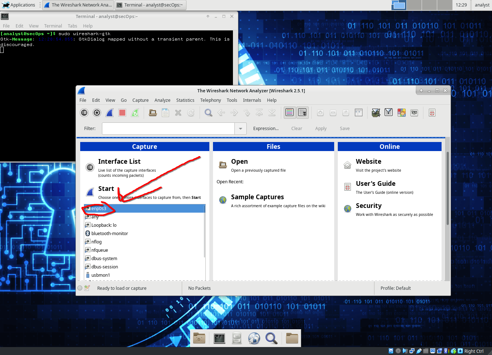
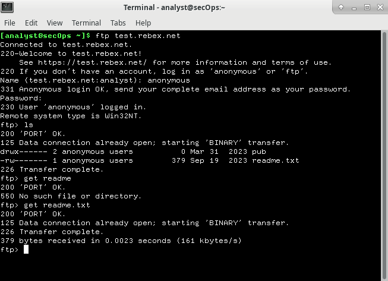
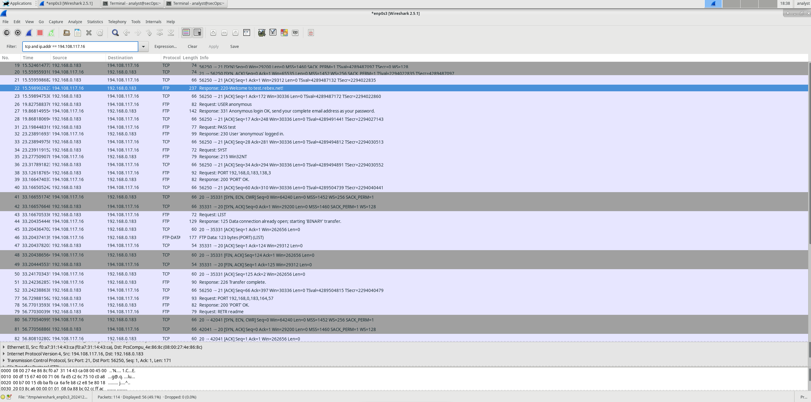
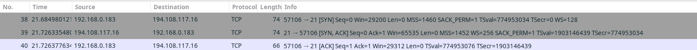
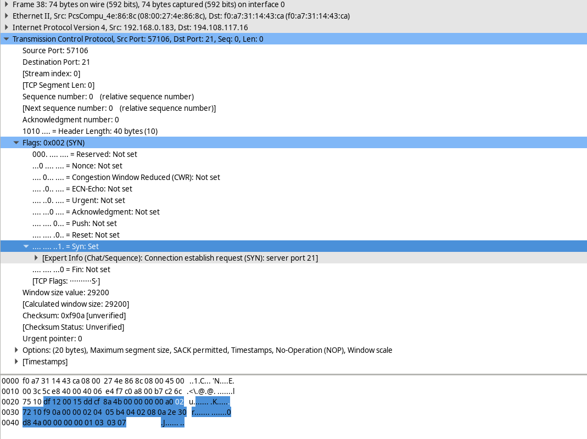
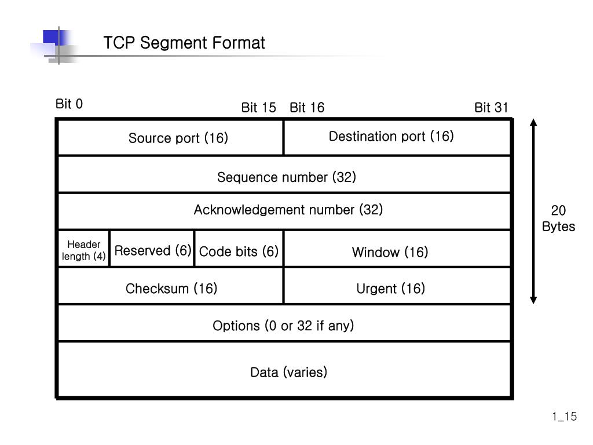

# Using Wireshark To Examine UDP And TCP Captures

## Environment
* This lab was carried out using the CyberOps VM workstation

## Part 1: Identify TCP Header Fields And Operation Using A Wireshark FTP Session Capture
### Starting A Wireshark Capture
* We first start wireshark using the command:

```
sudo wireshark-gtk &
```
* We then click on enp0s3 interface and then start to begin capturing packets
  


### Connecting To FTP Server
* We connect to an ftp server (ftp://test.rebex.net) using the following command:
```
ftp test.rebex.net
```
* Type in the command `ls` to view the files in the directory.
* Type in the command `get readme.txt` to retrieve the readme file.



* We then close the connection and check our TCP / UDP packets.

### Viewing In Wireshark
Setting the filter to `tcp and ip.addr == 194.108.117.16`



### Analyzing TCP Fields
Once the TCP filter is in place, the first three packets (shown in the top section) represent the sequence of [SYN], [SYN, ACK], and [ACK], which make up the TCP three-way handshake.


TCP is commonly used throughout a session to manage datagram delivery, confirm datagram receipt, and adjust window size. Every time data is exchanged between the FTP client and server, a new TCP session is initiated. Once the data transfer is complete, the TCP session is closed. When the FTP session ends, TCP ensures a clean shutdown and termination.

In Wireshark, you can find comprehensive TCP details in the packet details pane (middle section). Select the first TCP datagram from the host computer and expand the various sections of the TCP datagram, as illustrated below.





The diagram above illustrates a TCP datagram. Here’s a breakdown of each field:

    The TCP source port number is assigned to the host that initiates the TCP connection. Typically, this value is a random number above 1,023.
    The TCP destination port number identifies the upper-layer protocol or application on the remote host. Port numbers in the range of 0–1,023 are known as "well-known ports" and correspond to popular services like Telnet, FTP, and HTTP (as specified in RFC 1700). The unique session is identified by the combination of source IP address, source port, destination IP address, and destination port.

Note: In the Wireshark capture shown above, the destination port is 21, which is used by FTP. FTP servers listen on port 21 for incoming connections from clients.

    The Sequence number indicates the number of the last octet in a segment.
    The Acknowledgment number shows the next expected octet from the receiver.
    The Code bits carry special meanings related to session management and segment handling. Notable values include:
        ACK — Acknowledgment of a segment's receipt.
        SYN — Synchronize, set only when a new TCP session is established during the three-way handshake.
        FIN — Finish, signaling the request to close the TCP session.
    The Window size specifies the value of the sliding window, indicating how many octets can be sent before an acknowledgment is required.
    The Urgent pointer is used only when the Urgent (URG) flag is set, signaling that urgent data is being sent.
    The Options field currently includes just one option, which defines the maximum segment size for TCP (an optional value).

| Description  | Wireshark Results |
|:-------------|:------------------|
| Source IP address           | good swedish fish | 
| Destination IP address | good and plenty   | 
| Source port number           | good `oreos`      | 
| Destination port number           | good `zoute` drop |
| Sequence number           | good `zoute` drop |
| Acknowledgment number           | good `zoute` drop |
| Header length           | good `zoute` drop |
| Window size           | good `zoute` drop |
  

## Identify UDP Header Fields and Operation Using a Wireshark TFTP Session Capture

