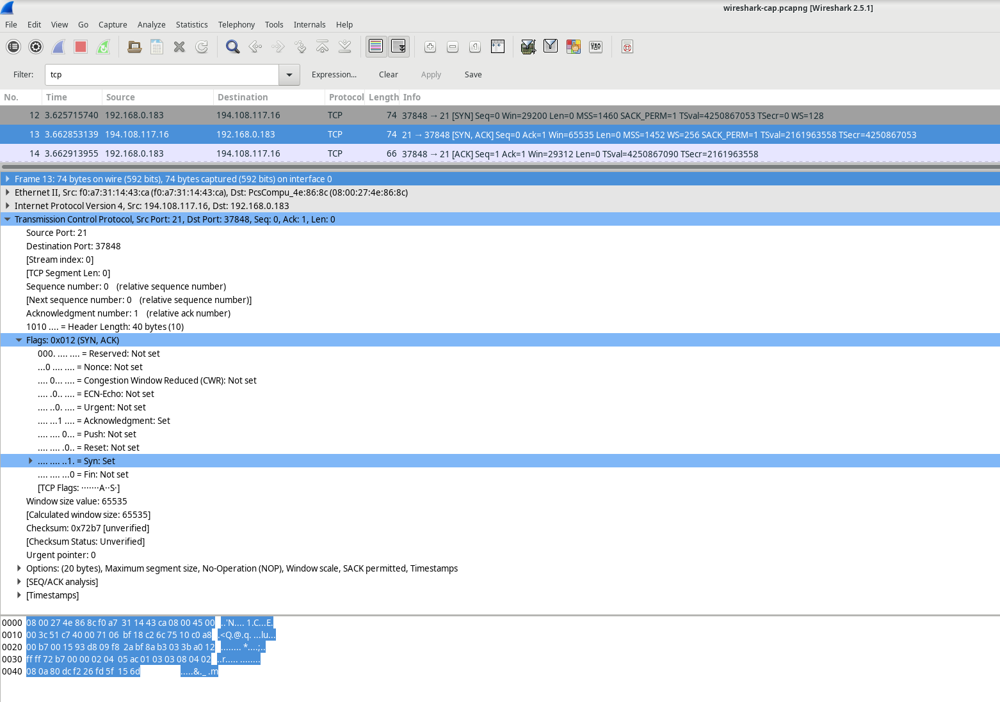

# Using Wireshark To Examine UDP And TCP Captures

## Environment
* This lab was carried out using the CyberOps VM workstation

## Part 1: Identify TCP Header Fields And Operation Using A Wireshark FTP Session Capture
### Starting A Wireshark Capture
* We first start wireshark using the command:

```
sudo wireshark-gtk &
```
* We then click on enp0s3 interface and then start to begin capturing packets
  


### Connecting To FTP Server
* We connect to an ftp server (ftp://test.rebex.net) using the following command:
```
ftp test.rebex.net
```
* Type in the command `ls` to view the files in the directory.
* Type in the command `get readme.txt` to retrieve the readme file.


* We then close the connection and check our TCP / UDP packets.

### Viewing In Wireshark
Setting the filter to `tcp and ip.addr == 194.108.117.16`


### Analyzing TCP Fields
Once the TCP filter is in place, the first three packets (shown in the top section) represent the sequence of [SYN], [SYN, ACK], and [ACK], which make up the TCP three-way handshake.


TCP is commonly used throughout a session to manage datagram delivery, confirm datagram receipt, and adjust window size. Every time data is exchanged between the FTP client and server, a new TCP session is initiated. Once the data transfer is complete, the TCP session is closed. When the FTP session ends, TCP ensures a clean shutdown and termination.

In Wireshark, you can find comprehensive TCP details in the packet details pane (middle section). Select the first TCP datagram from the host computer and expand the various sections of the TCP datagram, as illustrated below.


The diagram above illustrates a TCP datagram. Here’s a breakdown of each field:

    The TCP source port number is assigned to the host that initiates the TCP connection. Typically, this value is a random number above 1,023.
    The TCP destination port number identifies the upper-layer protocol or application on the remote host. Port numbers in the range of 0–1,023 are known as "well-known ports" and correspond to popular services like Telnet, FTP, and HTTP (as specified in RFC 1700). The unique session is identified by the combination of source IP address, source port, destination IP address, and destination port.

Note: In the Wireshark capture shown above, the destination port is 21, which is used by FTP. FTP servers listen on port 21 for incoming connections from clients.

    The Sequence number indicates the number of the last octet in a segment.
    The Acknowledgment number shows the next expected octet from the receiver.
    The Code bits carry special meanings related to session management and segment handling. Notable values include:
        ACK — Acknowledgment of a segment's receipt.
        SYN — Synchronize, set only when a new TCP session is established during the three-way handshake.
        FIN — Finish, signaling the request to close the TCP session.
    The Window size specifies the value of the sliding window, indicating how many octets can be sent before an acknowledgment is required.
    The Urgent pointer is used only when the Urgent (URG) flag is set, signaling that urgent data is being sent.
    The Options field currently includes just one option, which defines the maximum segment size for TCP (an optional value).

### SYN
| Description  | Wireshark Results |
|:-------------|:------------------|
| Source IP address           | 192.168.0.183 | 
| Destination IP address | 194.108.117.16 | 
| Source port number           | 37848  | 
| Destination port number           | 21 |
| Sequence number           | 0 |
| Acknowledgment number           | 0 |
| Header length           | 40 bytes |
| Window size           | 29200 |
  

### SYN ACK


| Description  | Wireshark Results |
|:-------------|:------------------|
| Source IP address           | 194.108.117.16 | 
| Destination IP address | 192.168.0.183 | 
| Source port number           | 21  | 
| Destination port number           | 37848 |
| Sequence number           | 0 |
| Acknowledgment number           | 0 |
| Header length           | 40 bytes |
| Window size           | 65535 |

### ACK


| Description  | Wireshark Results |
|:-------------|:------------------|
| Source IP address           | 192.168.0.183 | 
| Destination IP address | 194.108.117.16 | 
| Source port number           | 37848 | 
| Destination port number           | 21 |
| Sequence number           | 0 |
| Acknowledgment number           | 0 |
| Header length           | 32 bytes |
| Window size           | 229 |


Once a TCP session is established, FTP traffic can flow between the PC and the FTP server. The FTP client and server exchange data without being aware that TCP is managing and controlling the session. When the FTP server sends a Response: 220 to the client, the FTP client's TCP session sends an acknowledgment to the server's TCP session. This process can be observed in the Wireshark capture below.


Here's a rewritten explanation of the FTP session termination process:

When an FTP client completes its file transfer operations, it initiates the connection closure by sending a "quit" command. The FTP server responds with a 221 status code, signaling a farewell message.

The TCP connection termination follows a precise four-way handshake:

    The FTP server initiates the TCP session closure by sending a termination datagram to the client.
    The FTP client receives this termination signal and acknowledges it.
    The client then sends its own termination request back to the server.
    When the server receives this duplicate termination request, it sends a final acknowledgment (ACK) datagram.

This systematic process ensures a clean, orderly shutdown of the FTP connection, with both the client and server explicitly confirming the termination. Each step involves careful exchange of signals to guarantee that both parties agree the session is complete and no data remains unsynchronized.

The sequence represents a carefully choreographed digital handshake, where each side of the connection formally and politely says goodbye, ensuring no loose ends remain in the communication protocol.


By using an FTP filter, the full sequence of FTP traffic can be analyzed in Wireshark. Pay attention to the series of events throughout this FTP session. The username "anonbymous" was used to download the Readme file. Once the transfer was finished, the user closed the FTP session.


## Identify UDP Header Fields and Operation Using a Wireshark TFTP Session Capture

### Step 1: Starting Mininet and TFTP Service

First, I launch Mininet and enter the password "cyberops" when prompted to get started.

[analyst@secOps ~]$ sudo lab.support.files/scripts/cyberops_topo.py
[sudo] password for analyst:

Next, I start H1 and H2 at the Mininet prompt to prepare for the TFTP transfer.
`
*** Starting CLI:
mininet> xterm H1 H2
`
In the terminal for H1, then run the script to start the TFTP server.

[root@secOps analyst]# /home/analyst/lab.support.files/scripts/start_tftpd.sh
[root@secOps analyst]#

### Step 2: Creating a File for TFTP Transfer

Now, you need to create the file that will be transferred using TFTP. At the H1 terminal, create a text file in the /srv/tftp/ directory.
`
[root@secOps analyst]# echo "This file contains my tftp data." > /srv/tftp/my_tftp_data
`
Confirm that the file was created successfully and contains the expected text.
`
[root@secOps analyst]# cat /srv/tftp/my_tftp_data
This file contains my tftp data.
`
Because of the TFTP server’s security settings, the file on the receiving end must already exist. So, switch to H2 and create a file named my_tftp_data in the same directory.
`
[root@secOps analyst]# touch my_tftp_data
`
### Step 3: Capturing the TFTP Session in Wireshark

To capture the TFTP session, launch Wireshark on H1.
`
[root@secOps analyst]# wireshark &
`
In Wireshark, navigate to the Edit menu, select Preferences, then expand the Protocols section. Scroll down to find UDP, check the box to validate the UDP checksum if possible, and click OK to apply the changes.

Now, Your ready to capture the TFTP session and analyze the UDP headers in the Wireshark interface.
